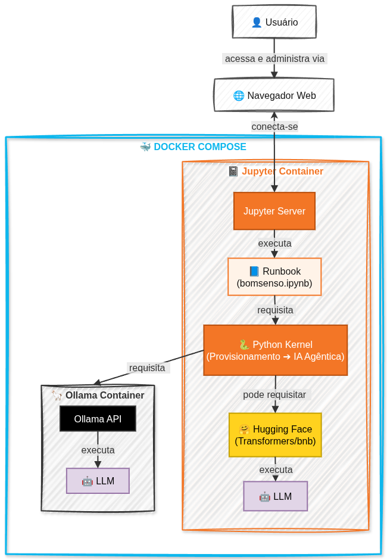

# BOMSenso

[](https://docs.docker.com/compose/)
[](https://owasp.org/www-project-cyclonedx/)
[](https://quay.io/repository/jupyter/pytorch-notebook?tab=tags&tag=cuda12-python-3.11.8)
[](https://github.com/langchain-ai/langchain/releases/tag/langchain%3D%3D1.3.13)
[](https://pypi.org/project/langchain-core/1.4.9/)
[](https://github.com/langchain-ai/langgraph/releases/tag/1.2.9)
[](https://github.com/open-quantum-safe/liboqs/releases/tag/0.16.0)
[](#)
[](https://hub.docker.com/r/ollama/ollama?tag=0.33.2)
[](https://github.com/cdxgen/cdxgen/releases/tag/v13.0.1)
[](https://github.com/owasp-dep-scan/dep-scan/releases/tag/v6.3.0)
[](https://github.com/pytorch/pytorch/releases/tag/v2.11.0)

[](https://huggingface.co/collections/Qwen/qwen38)
[](https://huggingface.co/collections/google/gemma-4)
[](https://huggingface.co/collections/ibm-granite/granite-42-language-models)
[](https://huggingface.co/openai)


O BOMSenso é um *framework open-source* de orquestração para geração e análise integrada de inventários de composição, utilizando o OWASP *CycloneDX Generator* (cdxgen) como mecanismo de geração dos artefatos. Seu nome combina os conceitos de *Bill of Materials* (BOM) e Senso, derivado do latim *sensus*, associado à percepção e ao entendimento, refletindo sua proposta de atuar como um motor orientado à interpretação de artefatos BOM.

Em uma abordagem de autoanálise, o *framework* correlaciona artefatos e informações de vulnerabilidades para produzir evidências estruturadas e apoiar a tomada de decisão. Desenvolvido para operar com modelos *open-weights* em ambientes *on-premise*, o processamento ocorre localmente, mantendo os dados restritos ao ambiente de execução, reforçando a soberania de dados e preservando a rastreabilidade operacional de ponta a ponta.

---

## 🏗️ Arquitetura e Pilares Técnicos

O projeto sustenta-se em 6 pilares fundamentais:

1. **Roteamento Adaptativo e Contexto Dinâmico (FinOps):** Detecção física de VRAM *in-memory* em GPUs NVIDIA, alocação dinâmica de LLMs e escalonamento automático da janela de memória (`num_ctx`). A topologia adapta-se desde abordagens de sobrevivência Single-LLM (4 GB) até expansões verticais em hardwares corporativos de alta performance.
2. **Inventário de Metadados (BOM):** Geração estática de *Bill of Materials* utilizando o padrão **CycloneDX** para uma taxonomia clara e estruturada das dependências.
3. **Auditoria de Vulnerabilidades (VDR):** Varredura local via `dep-scan`, gerando evidências (CVEs) em ambiente contêinerizado.
4. **Indexação Semântica (LazyGraphRAG):** Construção de um Grafo de Conhecimento em memória (via `networkx`) para navegação inteligente dos agentes nas dependências diretas e transitivas.
5. **Orquestração *Zero Trust* com *Artifact-Mediated Handoff* (LangGraph):** Deliberação agêntica estruturada com Segregação de Funções (SoD) e persistência em disco. O estado do grafo trafega apenas referências de arquivos, a orquestração conta com módulo interativo *Human-in-the-Loop* (HiTL) para *enforcement* de políticas e divide-se em:
   - 🕵️ **Cadeia de Decisão:** Analista (Extração e Síntese Técnica) e Supervisor/CISO (Veredito Base, deliberação de risco e bloqueio por omissão de *compliance*).
   - ⚖️ **Assurance Independente:** Auditor Interno (Validação de evidências e desafio técnico). Opera fora da cadeia de subordinação primária para gerar atestação imparcial.
6. **Atestação Pós-Quântica (PQC):** Motor criptográfico alinhado ao modelo *Zero Trust*, equipado com `liboqs` por meio de bindings em Python para assinar e validar envelopes de metadados utilizando **ML-DSA (FIPS 204)**, derivado do projeto *CRYSTALS-Dilithium*, além de suportar encapsulamento de chaves com **ML-KEM (FIPS 203)**, derivado do projeto *CRYSTALS-Kyber*.
---

## 🧬 Estrutura do *Pipeline* (As 8 Células)

O fluxo operacional deste *runbook* é orquestrado de forma encadeada nas seguintes etapas:

- **CÉLULA 1:** Motor BOMSenso - Roteamento Adaptativo de VRAM *(Detecção de hardware e matriz de roteamento).*
- **CÉLULA 2:** Provisionamento Unificado via API REST *(Cache e download em endpoints Ollama e Hugging Face).*
- **CÉLULA 3:** Inventários Estáticos *(Extração das 6 camadas e federação com UUID Mestre via CycloneDX).*
- **CÉLULA 4:** Pre-Cache do VDB *(Download do contêiner de Threat Intelligence - CVEs).*
- **CÉLULA 5:** Auditoria de Vulnerabilidades e Atestação *(Execução do OWASP dep-scan no lago de metadados).*
- **CÉLULA 6:** Motor LazyGraphRAG Oficial *(Ingestão semântica de componentes e vulnerabilidades VDR).*
- **CÉLULA 7:** Orquestração Agêntica *Zero Trust (LangGraph, Artifact-Mediated Handoff, módulo HiTL punitivo e geração do pacote ZIP).*
- **CÉLULA 8:** Verificação Criptográfica Pós-Quântica *(Validação de integridade das evidências via perfis FIPS 204 da liboqs).*

A arquitetura operacional do **BOMSenso** e o relacionamento entre seus principais componentes são apresentados na Figura 1.

<p align="center">
  
<p align="center">
  <strong>Figura 1 — Arquitetura operacional do BOMSenso.</strong>
</p>

---
## 🚀 Matriz de Roteamento - *Absolute Resolve*

O sistema classifica o perfil de *hardware* conforme a capacidade de VRAM disponível, abrangendo desde ambientes de entrada (4 GB) até infraestruturas massivas (≥ 300 GB). A orquestração *Zero Trust* é imutável e operada estritamente por 3 agentes (Analista, Supervisor e Auditor Interno).

> **Atenção à Governança:** O aumento de VRAM não concede maior autoridade à cadeia de decisão. Em vez disso, ele amplia a capacidade cognitiva da tríade ativa, permitindo a alocação de LLMs mais robustos e janelas de contexto estendidas para a leitura de artefatos complexos.

| VRAM Efetiva | Perfil de Hardware | Limite de Contexto |
| :--- | :--- | :--- |
| **4–6 GB** | 🪲 Fusca | 4K |
| **8 GB** | 🚙 Golf GTi | 8K |
| **12 GB** | 🚘 Corolla Altis | 12K |
| **16 GB** | 🛞 Camaro SS | 16K |
| **20 GB** | 🐎 Mustang GT | 20K |
| **24 GB** | 🏁 911 GT3 RS | 24K |
| **32 GB** | 🐂 Gallardo | 32K |
| **40 GB** | 💎 Centenario | 40K |
| **48 GB** | 🚓 M3 GTR | 48K |
| **64 GB** | 🏎️ Chiron | 64K |
| **80 GB** | ✈️ Airbus A380 | 80K |
| **96 GB** | 🛫 Tupolev Tu-144 | 96K |
| **141 GB** | 🛬 Antonov An-225 Mriya | 131K |
| **180 GB** | 🛩️ F-39E Gripen | 163K |
| **192 GB** | 🦇 Su-57 Felon | 196K |
| **288 GB** | 🦅 F-22 Raptor | 262K |
| **≥ 300 GB** | 🌎 Absolute Resolve | 256K+ |

---
### Critério de classificação de SLM

Para fins classificatórios, os modelos de linguagem com até 5 bilhões de parâmetros (≤ 5B) foram categorizados como *Small Language Models* (SLMs). Essa delimitação possui como amparo teórico o trabalho de [Lu et al. (2024)](https://arxiv.org/pdf/2409.15790), dedicado à investigação de SLMs. A definição adotada neste *framework* é exclusivamente operacional, para fins de classificação e roteamento experimental, não constituindo uma definição universal da categoria SLM.

Modelos acima desse limite são tratados, neste *framework*, como *Large Language Models* (LLMs), independentemente de sua quantização ou do consumo efetivo de memória durante a inferência.

---

## 🐳 Ambiente e Contêineres

O ambiente é 100% orquestrado via **Docker Compose**, provendo isolamento lógico e gerando as seguintes imagens e instâncias:

1. **bomsenso-jupyter:1.0.0** → `bomsenso_jupyter` (Contêiner)
2. **ollama/ollama:0.33.2** → `bomsenso_ollama` (Contêiner)

---
## Repositório

Para clonar o projeto:

```bash
git clone https://github.com/williansdb/bomsenso.git
cd bomsenso
